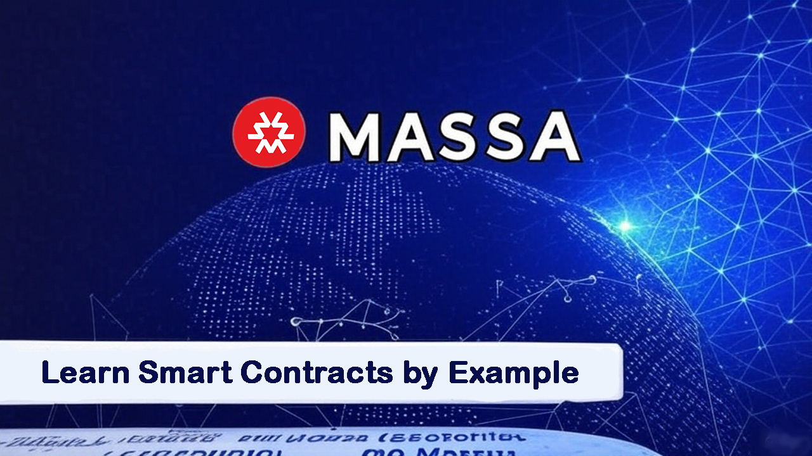

# Learn Massa Smart Contracts by Example: Lessons from EagleFi

Welcome! This tutorial guides you through building smart contracts on the Massa blockchain using practical examples drawn directly from the [EagleFi DEX project](https://github.com/NaDasai/eagle-finance). We'll cover essential concepts, starting with the basics and progressing to more advanced techniques.

**Target Audience:** Developers looking to learn Massa smart contract development using AssemblyScript. Familiarity with basic programming concepts is assumed.

**Source Code:** All examples are simplified snippets from the full EagleFi project, available on [GitHub](https://github.com/NaDasai/eagle-finance).

<!-- truncate -->

## Table of Contents

**Beginner**
1.  [Setting Up Your Massa Project](#1-setting-up-your-massa-project)
2.  [Handling Function Inputs](#2-handling-function-inputs)
3.  [Accessing Basic Contract & Transaction Context](#3-accessing-basic-contract--transaction-context)
4.  [Basic State Management (Storage)](#4-basic-state-management-storage)

**Intermediate**

5.  [Utility: Wrapping Native MAS to WMAS](#5-utility-wrapping-native-mas-to-wmas)
6.  [Working with Native MAS Coins](#6-working-with-native-mas-coins)
7.  [Creating Your Custom MRC20 Token](#7-creating-your-custom-mrc20-token)
8.  [Interacting with MRC20 Tokens](#8-interacting-with-mrc20-tokens)

**Advanced**

9. [Deploying Contracts from Other Contracts](#9-deploying-contracts-from-other-contracts)
10. [Working with Complex Data: Serializable Objects](#10-working-with-complex-data-serializable-objects)
11. [Best Practice: Refunding Storage Costs](#11-best-practice-refunding-storage-costs)
12. [Secure Ownership with Two-Step Transfer](#12-secure-ownership-with-two-step-transfer)
13. [Security Pattern: Reentrancy Guard](#13-security-pattern-reentrancy-guard)

**Conclusion**

14. [Conclusion](#14-conclusion)

---

# Beginner

This section covers the absolute basics: setting up your development environment, understanding how functions receive data, getting essential context information, and storing simple data.

## 1. Setting Up Your Massa Project

First, let's set up the basic structure for a Massa smart contract project using the official initializer.

1.  **Initialize a new project:** This command creates a new directory with the necessary boilerplate code and configuration.
    ```bash
    npx @massalabs/sc-project-initializer init my-first-sc
    cd my-first-sc
    ```
2.  **Install dependencies:** This installs the required Node.js packages, including the Massa SDK and AssemblyScript compiler tools.
    ```bash
    npm install
    ```
3.  **Configure environment variables:** Create a `.env` file from the provided example. This file will store sensitive information like your private key.
    ```bash
    cp .env.example .env
    ```
4.  **Add your private key:** Edit the `.env` file and insert your Massa account private key. This is needed for deploying contracts and sending transactions.
    ```bash
    PRIVATE_KEY=your_private_key
    ```
    **Important:** Never commit your `.env` file containing private keys to version control (like Git). Ensure `.env` is listed in your `.gitignore` file.

## 2. Handling Function Inputs

Massa smart contract functions receive their arguments encoded into a single byte array (`StaticArray<u8>`). To work with these arguments within your function, you need to deserialize them using the `Args` class provided by the SDK.

Here's how you can extract different data types from the input byte array, demonstrated in the `createNewToken` function from `tokenDeployer.ts`:
```typescript
import { Args } from "@massalabs/massa-as-sdk";
const args = new Args(binaryArgs);

const tokenName = args.nextString().expect('Invalid token name');
const tokenSymbol = args.nextString().expect('Invalid token symbol');
const decimals = args.nextU8().expect('Invalid decimals');
const totalSupply = args.nextU256().expect('Invalid total supply');
```
The `next<Type>()` methods deserialize the next part of the byte array according to the expected type. The `.expect()` method provides a convenient way to handle potential errors during deserialization, reverting the transaction with a helpful message if the data is missing or malformed.

## 3. Accessing Basic Contract & Transaction Context

During execution, a smart contract often needs information about its environment. The `Context` object provides some of this essential information.

*   **Get Caller Address:** Identify the address that initiated the current function call. This is crucial for access control and tracking interactions.
    ```typescript
    import { Context } from "@massalabs/massa-as-sdk";

    const callerAddress = Context.caller();
    ```

*   **Get Current Contract Address:** Obtain the address of the smart contract currently being executed. Useful when the contract needs to reference itself.
    ```typescript
    import { Context } from "@massalabs/massa-as-sdk";

    const contractAddress = Context.callee();
    ```

*   **Get Transferred Coins (in current call):** You can determine how many MAS coins were sent *along with the current function call* using `Context.transferredCoins()`. This is essential for functions that require payment. Example from `tokenDeployer.ts` (L97):
    ```typescript
    import { Context } from "@massalabs/massa-as-sdk";

    // Get the coins transferred to the smart contract
    const sent = Context.transferredCoins();
    ```

## 4. Basic State Management (Storage)

Smart contracts need to persist data between transactions. Massa provides a key-value storage system where both keys and values are stored as byte arrays (`StaticArray<u8>`).

*   **Defining and Setting State Variables:** You typically define keys as constants (often converting strings to bytes) and use `Storage.set()` to store data.

    This example from the `registry` contract shows how to define a key and implement a function to set the address of a swap router:
    ```typescript
    import { Storage, assertIsSmartContract} from "@massalabs/massa-as-sdk";

    // Storage Key containning the address of the swap Router contract to be used on all the pools
    export const swapRouterAddress = stringToBytes('swapRouterAddress');


    export function setSwapRouterAddress(binaryArgs: StaticArray<u8>): void {
       const args = new Args(binaryArgs);

      // Get the swapRouterAddress input
      const swapRouterAddressInput = args
        .nextString()
        .expect('SwapRouterAddress is missing or invalid');

      // Assert that the swapRouterAddress is a smart contract
      assertIsSmartContract(swapRouterAddressInput);

      // Set the swapRouterAddress Storage to the input value
      Storage.set(swapRouterAddress, stringToBytes(swapRouterAddressInput));
    }
    ```

*   **Retrieving State Variables:** Use `Storage.get()` with the appropriate key to retrieve stored data. Remember that the data is returned as bytes and may need conversion. It's also vital to check if the data actually exists before using it.

    This example shows how to retrieve the previously stored swap router address:
    ```typescript
    import { Storage } from "@massalabs/massa-as-sdk";

    export function getSwapRouterAddress(): StaticArray<u8> {  // Get the swapRouterAddress
      // Retrieve the swapRouterAddress from the storage
      const swapRouterAddressStored = Storage.get(swapRouterAddress);

      // Assert that the swapRouterAddress is set (Not empty storage)
      assert(swapRouterAddressStored.length > 0, 'Swap Router Address is not set');

      return swapRouterAddressStored;
    }
    ```

---

# Intermediate

This section builds upon the basics, covering interactions with Massa's native coin, creating and interacting with standard MRC20 tokens, and understanding allowances.

## 5. Utility: Wrapping Native MAS to WMAS

WMAS (Wrapped MAS) is an MRC20 token that represents native MAS on a 1:1 basis. Wrapping allows native MAS to be used in contexts requiring MRC20 tokens, such as DEX liquidity pools.

*   **The `wrapMasToWMAS` Helper:** This function takes an amount of MAS to wrap and the address of the WMAS contract. It checks if sufficient native MAS was sent with the call (to cover the wrap amount plus estimated storage costs for minting WMAS) and then calls the `deposit` function on the WMAS contract.

    Implementation from `utils/index.ts`:
    ```typescript
    /**
     * Wraps a specified amount of MAS coins into WMAS tokens.
     *
     * @param amount - The amount of MAS coins to be wrapped into WMAS tokens.
     * @param wmasAddress - The address of the WMAS token contract.
     * @throws Will throw an error if the transferred MAS coins are insufficient.
     */
    export function wrapMasToWMAS(amount: u256, wmasAddress: Address): void {
      // Get the transferred coins from the operation
      const transferredCoins = Context.transferredCoins();

      // Get the wmas contract instance
      const wmasToken = new IWMAS(wmasAddress);

      const mintStorageCost = u256.fromU64(
        _computeMintStorageCost(Context.callee()),
      );

      const amountToWrap = SafeMath256.add(amount, mintStorageCost);

      // Ensure that transferred coins are greater than or equal to the amount to wrap
      assert(
        u256.fromU64(transferredCoins) >= amountToWrap,
        'INSUFFICIENT MAS COINS TRANSFERRED',
      );

      // Wrap MAS coins into WMAS
      wmasToken.deposit(amountToWrap.toU64());

      // Generate an event to indicate that MAS coins have been wrapped into WMAS
      generateEvent(`WRAP_MAS: ${amount.toString()} of MAS wrapped into WMAS`);
    }
    ```

*   **Usage:** In scenarios where a function receives native MAS but needs to interact with a system using WMAS (like swapping MAS for another token), this helper can be called first.

    Example usage within the `_swap` function in `swapRouter.ts`:
    ```typescript
    function _swap(
      swapPath: SwapPath,
      callerAddress: Address,
      contractAddress: Address,
      toAddress: Address,
      coinsOnEachSwap: u64,
    ): u256 {
      const poolAddress = swapPath.poolAddress;
      const tokenInAddress = swapPath.tokenInAddress.toString();
      const tokenOutAddress = swapPath.tokenOutAddress.toString();
      const amountIn = swapPath.amountIn;

      // ...


      // Wrap mas before swap and transfer wmas
      const registryContractAddressStored = bytesToString(
        Storage.get(registryContractAddress),
      );

      // Get the wmas token address
      const wmasTokenAddressStored = new Address(
        new IRegistery(
          new Address(registryContractAddressStored),
        ).getWmasTokenAddress(),
      );

      // Wrap Mas to WMAS (assuming amountIn is the native MAS sent)
      wrapMasToWMAS(amountIn, wmasTokenAddressStored);

      // ... subsequent logic uses the WMAS minted to this contract ...

    }
    ```

## 6. Working with Native MAS Coins

Contracts can interact with Massa's native coin (MAS) in more ways than just checking the amount sent in a call.

*   **Get Contract's Total MAS Balance:** Retrieve the current total balance of native MAS coins held by the smart contract itself.
    ```typescript
    import { balance } from "@massalabs/massa-as-sdk";

    const SCBalance = balance();
    ```

*   **Transfer Coins:** Contracts can send MAS coins from their own balance to another address using `transferCoins()`. Example from `utils/index.ts`:
    ```typescript
    import { transferCoins } from "@massalabs/massa-as-sdk";

    function _transferRemaining(to: Address, value: u64): void {
      // Transfer coins to the specified address
      transferCoins(to, value);
    }
    ```

## 7. Creating Your Custom MRC20 Token

Massa uses the MRC20 standard for fungible tokens (similar to ERC20). You can create your own custom token by extending the standard implementation provided by `@massalabs/sc-standards`.

1.  **Install the Standards Package:**
    ```bash
    npm install @massalabs/sc-standards
    ```
2.  **Build Your Token Contract:** Create a new AssemblyScript file (e.g., `token.ts`).
    *   **Export Standard Functions:** Re-export the default MRC20 functions you don't intend to modify. This avoids rewriting standard logic. Example from `token.ts` (L396):
        ```typescript
        export {
          VERSION,
          version,
          name,
          symbol,
          decimals,
          totalSupply,
          balanceOf,
          allowance,
          increaseAllowance,
          decreaseAllowance,
        } from '@massalabs/sc-standards/assembly/contracts/MRC20/MRC20';
        ```
    *   **Import Standard Keys:** Import the predefined storage keys for standard MRC20 properties if you need to interact with them directly (e.g., in your constructor).
        ```typescript
        import {
          NAME_KEY,
          DECIMALS_KEY,
          SYMBOL_KEY,
          TOTAL_SUPPLY_KEY,
        } from '@massalabs/sc-standards/assembly/contracts/MRC20/MRC20';
        ```
    *   **Add Custom Features:** To add fields like description, image, or website:
        1.  **Define new storage keys:**
            ```typescript
            export const TOKEN_DESCRIPTION = stringToBytes('TOKEN_DESCRIPTION');
            export const TOKEN_IMAGE = stringToBytes('TOKEN_IMAGE');
            export const TOKEN_WEBSITE = stringToBytes('TOKEN_WEBSITE');
            ```
        2.  **Set values in the constructor:** Read these potentially optional values from the arguments and store them using `Storage.set()`. Use `unwrapOrDefault()` for optional arguments.
            ```typescript
            export function constructor(binaryArgs: StaticArray<u8>): void {
              assert(isDeployingContract());

              const args = new Args(binaryArgs);

              // Admin arg passed by the token deployer to specify the owner of the token
              const admin = args.nextString().expect('Invalid admin');
              const tokenName = args.nextString().expect('Invalid token name');
              const tokenSymbol = args.nextString().expect('Invalid token symbol');
              const decimals = args.nextU8().expect('Invalid decimals');
              const totalSupply = args.nextU256().expect('Invalid total supply');
              // optional parameter
              const image = args.nextString().unwrapOrDefault();
              // optional Parameter
              const website = args.nextString().unwrapOrDefault();
              // optional parameter
              const description = args.nextString().unwrapOrDefault();

              // ...

              // Set the token name, symbol, decimals, total supply, image, website and description in the storage
              Storage.set(NAME_KEY, stringToBytes(tokenName));
              Storage.set(SYMBOL_KEY, stringToBytes(tokenSymbol));
              Storage.set(DECIMALS_KEY, [decimals]);
              Storage.set(TOTAL_SUPPLY_KEY, u256ToBytes(totalSupply));
              Storage.set(TOKEN_IMAGE, stringToBytes(image));
              Storage.set(TOKEN_DESCRIPTION, stringToBytes(description));
              Storage.set(TOKEN_WEBSITE, stringToBytes(website));

              // ...
            }
            ```
        3.  **Implement getter functions:** Provide functions to retrieve the custom data from storage.
            ```typescript
            export function image(_: StaticArray<u8>): StaticArray<u8> {
              return Storage.get(TOKEN_IMAGE);
            }

            export function website(_: StaticArray<u8>): StaticArray<u8> {
              return Storage.get(TOKEN_WEBSITE);
            }

            export function description(_: StaticArray<u8>): StaticArray<u8> {
              return Storage.get(TOKEN_DESCRIPTION);
            }
            ```

## 8. Interacting with MRC20 Tokens

To interact with existing MRC20 tokens (standard or custom) from within your smart contract, you can use wrappers or interfaces.

*   **Using `MRC20Wrapper` or Custom Interfaces:** The `@massalabs/sc-standards` package provides `MRC20Wrapper`. For tokens with custom functions (like the one created in Section 7), it's best to create a custom interface that *extends* `MRC20Wrapper`, adding methods for your custom functions.

    Example `IMRC20` interface extending the standard wrapper:
    ```typescript
    import { MRC20Wrapper } from "@massalabs/sc-standards/assembly/contracts/MRC20/wrapper";

    export class IMRC20 extends MRC20Wrapper implements Serializable {
       constructor(origin: Address = new Address()) {
        super(origin);
      }

      // Add you custom functions here, like image(), website(), description()
     image(): string {
        return bytesToString(call(this._origin, 'image', NoArg, 0));
      }

      website(): string {
        return bytesToString(call(this._origin, 'website', NoArg, 0));
      }

      description(): string {
        return bytesToString(call(this._origin, 'description', new Args(), 0));
      }

      // ...
    }
    ```

*   **Transferring Tokens (`transferFrom`)**: To allow your contract (e.g., a DEX router) to spend a user's tokens, the user must first call `approve` on the token contract, granting your contract an allowance. Your contract then uses `transferFrom` to execute the transfer. It's crucial to check the user's balance and allowance beforehand. Massa standards also provide helpers like `getBalanceEntryCost` to estimate the MAS cost associated with storage changes during the transfer.

    Example from `swapRouter.ts` showing checks and `transferFrom`:
    ```typescript
    import { getBalanceEntryCost } from '@massalabs/sc-standards/assembly/contracts/MRC20/MRC20-external';
    import { IMRC20 } from '../interfaces/IMRC20';

    function _swap(
      swapPath: SwapPath,
      callerAddress: Address,
      contractAddress: Address,
      toAddress: Address,
      coinsOnEachSwap: u64,
    ): u256 {
      // ...

      const tokenIn = new IMRC20(swapPath.tokenInAddress);

      // ...

      // Check for balance
      const tokenInBalance = tokenIn.balanceOf(callerAddress);

      assert(tokenInBalance >= amountIn, 'INSUFFICIENT_TOKEN_IN_BALANCE');

      const tokenInAllownace = tokenIn.allowance(
        callerAddress,
        contractAddress,
      );

      // Check for allowance
      assert(tokenInAllownace >= amountIn, 'INSUFFICIENT_TOKEN_IN_ALLOWANCE');

      // Transfer amountIn from user to this contract
      tokenIn.transferFrom(
        callerAddress,
            contractAddress,
            amountIn,
            getBalanceEntryCost(tokenInAddress, contractAddress.toString()),
          );

      // ...

    }
    ```

---

# Advanced

This section delves into more complex topics like deploying contracts from contracts, handling complex data structures, and implementing important security and efficiency patterns.

## 9. Deploying Contracts from Other Contracts

A powerful feature is the ability for one smart contract to deploy another. This is used in EagleFi's `Registry` contract to deploy new liquidity pool contracts.

1.  **Prerequisites:**
    *   Install the `@massalabs/as-transformer` package (usually as a dev dependency).
    *   Define an interface (e.g., `interfaces/basicPool.ts`) for the contract you intend to deploy. This helps structure the interaction.
2.  **Deployment Logic:** Use the `createSC` function with the target contract's bytecode (`.wasm` file) to deploy a new instance. Then, interact with the new contract via its interface to call initialization functions.

    Here's an example from the `Registry` contract's `_createNewPool` function (L618) deploying a `basicPool` contract:
    ```typescript
    import { createSC, fileToByteArray } from "@massalabs/massa-as-sdk";

    function _createNewPool(
      aTokenAddress: string,
      bTokenAddress: string,
      inputFeeRate: u64,
    ): CreateNewPoolData {
      // ...

      //  Deploy the pool contract
      const poolByteCode: StaticArray<u8> = fileToByteArray('build/basicPool.wasm');
      const poolAddress = createSC(poolByteCode);

      //  Init the pool contract
      const poolContract = new IBasicPool(poolAddress);

      poolContract.init(
        aTokenAddress,
        bTokenAddress,
        inputFeeRate,
        feeShareProtocolStored,
        flashLoanFeeStored,
        Context.callee().toString(), // registry address
      );

      // ...
    }
    ```

## 10. Working with Complex Data: Serializable Objects

Instead of passing numerous individual arguments to functions, Massa allows you to define custom classes that implement the `Serializable` interface. This enables you to bundle related data and pass it as a single, complex object.

*   **Defining a Serializable Class:** You need to implement `serialize` (object to bytes) and `deserialize` (bytes to object) methods.

    Example `SwapPath` class from `structs/swapPath.ts`:
    ```typescript
    import { Args, Result, Serializable } from '@massalabs/as-types';
    import { Address } from '@massalabs/massa-as-sdk';
    import { u256 } from 'as-bignum/assembly';

    export class SwapPath implements Serializable {
      constructor(
        public poolAddress: Address = new Address(),
        public tokenInAddress: Address = new Address(),
        public tokenOutAddress: Address = new Address(),
        public receiverAddress: Address = new Address(),
        public amountIn: u256 = u256.Zero,
        public minAmountOut: u256 = u256.Zero,
        public isTransferFrom: bool = false,
      ) {}

      serialize(): StaticArray<u8> {
        return new Args()
          .add(this.poolAddress)
          .add(this.tokenInAddress)
          .add(this.tokenOutAddress)
          .add(this.receiverAddress)
          .add(this.amountIn)
          .add(this.minAmountOut)
          .add(this.isTransferFrom)
          .serialize();
      }

      deserialize(data: StaticArray<u8>, offset: i32): Result<i32> {
        const args = new Args(data, offset);

        this.poolAddress = new Address(args.nextString().expect('Invalid address'));
        this.tokenInAddress = new Address(
          args.nextString().expect('Invalid address'),
        );
        this.tokenOutAddress = new Address(
          args.nextString().expect('Invalid address'),
        );
        this.receiverAddress = new Address(
          args.nextString().expect('Invalid address'),
        );
        this.amountIn = args.nextU256().expect('Invalid amount in');
        this.minAmountOut = args.nextU256().expect('Invalid min amount out');
        this.isTransferFrom = args.nextBool().expect('Invalid isTransferFrom');

        return new Result(args.offset);
      }

      toString(): string {
        return (
          `Pool Address: ${this.poolAddress.toString()}\n` +
          `Token In Address: ${this.tokenInAddress.toString()}\n` +
          `Token Out Address: ${this.tokenOutAddress.toString()}\n` +
          `Receiver Address: ${this.receiverAddress.toString()}\n` +
          `Amount In: ${this.amountIn.toString()}\n` +
          `Min Amount Out: ${this.minAmountOut.toString()} \n` +
          `Is Transfer From: ${this.isTransferFrom}`
        );
      }
    }
    ```

*   **Using Serializable Objects in Functions:** You can deserialize these objects (or arrays of them) from the `binaryArgs` using methods like `nextSerializableObjectArray`.

    Example from `swapRouter.ts` deserializing an array of `SwapPath` objects:
    ```typescript
    import { SwapPath } from '../structs/swapPath';
    import { Args } from '@massalabs/as-types';

    export function swap(binaryArgs: StaticArray<u8>): void {
      // ...

      const args = new Args(binaryArgs);

      // Read the swap Path array args
      let swapPathArray = args
        .nextSerializableObjectArray<SwapPath>()
        .expect('Invalid swap path array');

      // ...
    }
    ```

## 11. Best Practice: Refunding Storage Costs

Users interacting with smart contracts often send more MAS coins than strictly necessary to cover potential storage costs incurred during execution. It's essential to implement a mechanism to refund any unused MAS back to the caller.

*   **The `transferRemaining` Function:** This utility calculates the net MAS spent or gained by the contract during an operation (by comparing balances before and after) and refunds the difference relative to the amount initially sent by the user.

    Implementation from `utils/index.ts`:
    ```typescript
    /**
     * @notice Function to transfer remaining Massa coins to a recipient at the end of a call
     * @param balanceInit Initial balance of the SC (transferred coins + balance of the SC)
     * @param balanceFinal Balance of the SC at the end of the call
     * @param sent Number of coins sent to the SC
     * @param to Caller of the function to transfer the remaining coins to
     */
    export function transferRemaining(
      balanceInit: u64,
      balanceFinal: u64,
      sent: u64,
      to: Address,
    ): void {
      if (balanceInit >= balanceFinal) {
        // Some operation might spend Massa by creating new storage space
        const spent = SafeMath.sub(balanceInit, balanceFinal);
        generateEvent(`Spent ${spent} coins`);
        assert(spent <= sent, 'SPENT_MORE_COINS_THAN_SENT');
        if (spent < sent) {
          // SafeMath not needed as spent is always less than sent
          const remaining: u64 = sent - spent;
          _transferRemaining(to, remaining);
        }
      } else {
        // Some operation might unlock Massa by deleting storage space
        const received = SafeMath.sub(balanceFinal, balanceInit);
        const totalToSend: u64 = SafeMath.add(sent, received);
        _transferRemaining(to, totalToSend);
      }
    }

    function _transferRemaining(to: Address, value: u64): void {
      transferCoins(to, value);
    }
    ```

*   **Usage:** To use this, capture the contract balance and sent coins at the start of your function, execute the core logic, capture the balance again at the end, and finally call `transferRemaining`.

    Example from `basicPool.ts` `syncReserves` function:
    ```typescript
    import {
      transferRemaining
    } from '../utils';
    import {
      Context,
      balance,
    } from '@massalabs/massa-as-sdk';

    export function syncReserves(): void {
      // ...
      const SCBalance = balance(); // Balance before logic
      const sent = Context.transferredCoins(); // Coins sent with call
      // ...
      // --- Core function logic ---
      // ...

      // Transfer remaining coins to the caller
      transferRemaining(SCBalance, balance(), sent, Context.caller()); // Pass initial balance, final balance, sent amount, and caller
    }
    ```

## 12. Secure Ownership with Two-Step Transfer

Standard single-step ownership transfers in smart contracts carry the risk of irrecoverably losing control if the new owner's address is entered incorrectly. EagleFi implements a robust two-step ownership transfer mechanism. This pattern significantly enhances security by requiring confirmation from the proposed new owner before the transfer is finalized.

**How it Works:**
 1.  The current owner initiates a transfer, designating a `pendingOwner`.
 2.  The designated `pendingOwner` must actively call an `acceptOwnership` function to claim ownership.
 
Here is an example of how this pattern is implemented in EagleFi. you can find the full implementation in the `utils/ownership.ts`:

 ```typescript	
 // Storage key for the owner
 const OWNER_KEY = 'OWNER';
 // Storage key for the pending owner
 const pendingOwner = 'PENDING_OWNER';
 
 
 /**
  * Sets the owner of the contract.
  *
  * @param owner - The address to set as owner.
  */
 export function _setOwner(owner: Address): void {
   Storage.set(OWNER_KEY, owner.toString());
 }
 
 /**
  * Returns the owner address of the contract.
  *
  * @returns The owner address.
  */
 export function _ownerAddress(): Address {
   return new Address(Storage.get(OWNER_KEY));
 }
 
 
 /**
  * Transfers the ownership of the contract to a new owner.
  *
  * @param binaryArgs - The binary arguments containing the new owner address.
  */
 export function transferOwnership(binaryArgs: StaticArray<u8>): void {
   const args = new Args(binaryArgs);
   const newOwner = args.nextString().expect('Invalid new owner');
 
   // Ensure that the caller is the owner
   _onlyOwner();
 
   // Ensure that the new owner address is valid
   assert(validateAddress(newOwner), 'INVALID_OWNER_ADDRESS');
 
   // Set a new pending owner
   Storage.set(pendingOwner, newOwner);
 
   // Emit an event
   generateEvent(ownershipTransferStartedEvent(_ownerAddress(), new Address(newOwner)));
 }
 
 /**
  * Accepts the ownership transfer of the contract.
  */
 export function acceptOwnership(): void {
   const caller = Context.caller();
   const storedPendingOwner = Storage.get(pendingOwner);
 
   // Ensure that the caller is the pending owner
   assert(caller.toString() === storedPendingOwner, 'CALLER_IS_NOT_PENDING_OWNER');
 
   // Set the new owner
   Storage.set(OWNER_KEY, caller.toString());
 
   // Delete the pending owner
   Storage.del(pendingOwner);
 
   // Emit an event
   generateEvent(ownershipTransferAcceptedEvent(_ownerAddress(), caller));
 }
 
 // Example Usage in Constructor:
 export function constructor(binaryArgs: StaticArray<u8>): void {
   // Set the deployer as the initial owner
   _setOwner(Context.caller());
 
   // Other initialization code...
 }
```

## 13. Security Pattern: Reentrancy Guard

Reentrancy attacks can occur when a contract makes an external call to another (potentially malicious) contract, which then immediately calls back into the original contract before the first call has finished executing. Massa does not inherently prevent this. You can implement a reentrancy guard using a simple locking mechanism (status flag in storage).

*   **The `ReentrancyGuard` Class:** This class provides functions to initialize the guard, lock (`nonReentrant`), and unlock (`endNonReentrant`) the contract state.

    Implementation inspired by OpenZeppelin, from `lib/ReentrancyGuard.ts`:
    ```typescript
    import { Storage } from '@massalabs/massa-as-sdk';
    import { byteToU8, stringToBytes, u8toByte } from '@massalabs/as-types';

    export const STATUS = stringToBytes('STATUS');

    const _NOT_ENTERED: u8 = 1;
    const _ENTERED: u8 = 2;

    /// @title Reentrancy Guard
    /// @notice Contract module that helps prevent reentrant calls to a function
    export class ReentrancyGuard {
      static __ReentrancyGuard_init(): void {
        assert(!Storage.has(STATUS), 'ReentrancyGuard already initialized');

        Storage.set(STATUS, u8toByte(_NOT_ENTERED));
      }

      /// @notice Prevents a contract from calling itself, directly or indirectly.
      /// Calling a `nonReentrant` function from another `nonReentrant`
      /// function is not supported. It is possible to prevent this from happening
      /// by making the `nonReentrant` function external, and making it call a
      /// `private` function that does the actual work
      static nonReentrant(): void {
        // On the first call to nonReentrant, _notEntered will be true

        assert(
          byteToU8(Storage.get(STATUS)) == _NOT_ENTERED,
          'ReentrancyGuard: calling nonReentrant while already in a call to nonReentrant',
        );

        // Any calls to nonReentrant after this point will fail
        Storage.set(STATUS, u8toByte(_ENTERED));
      }

      static endNonReentrant(): void {
        Storage.set(STATUS, u8toByte(_NOT_ENTERED));
      }
    }
    ```

*   **Usage:**
    1.  **Initialize:** Call `ReentrancyGuard.__ReentrancyGuard_init()` once in your contract's constructor.
        ```typescript
        import { ReentrancyGuard } from '../lib/ReentrancyGuard';

        export function constructor(binaryArgs: StaticArray<u8>): void {
           // This line is important. It ensures that this function can't be called in the future.
          // If you remove this check, someone could call your constructor function and reset your smart contract.
          assert(Context.isDeployingContract());

          // ...

          // Initialize the reentrancy guard
          ReentrancyGuard.__ReentrancyGuard_init();
        }
        ```
    2.  **Protect Functions:** Wrap the logic of functions susceptible to reentrancy by calling `nonReentrant()` at the beginning and `endNonReentrant()` at the end.

        Example from `registry.ts` `setWmasTokenAddress` function:
        ```typescript
        export function setWmasTokenAddress(binaryArgs: StaticArray<u8>): void {
          // start reentrancy guard
          ReentrancyGuard.nonReentrant(); // Lock

          // Only owner of registery can set wmas token address
          onlyOwner();

          const args = new Args(binaryArgs);

          const wmasTokenAddressInput = args
            .nextString()
            .expect('WmasTokenAddress is missing or invalid');

          // Get the current balance of the smart contract
          const SCBalance = balance();
          // Get the coins transferred to the smart contract
          const sent = Context.transferredCoins();

          // Ensure taht the wmasTokenAddress is a smart contract address
          assertIsSmartContract(wmasTokenAddressInput);

          // Store wmasTokenAddress
          Storage.set(wmasTokenAddress, stringToBytes(wmasTokenAddressInput));

          // Emit an event
          generateEvent(
            createEvent('UPDATE_WMAS_TOKEN_ADDRESS', [
              Context.callee().toString(), // Smart contract address
              Context.caller().toString(), // Caller address
              wmasTokenAddressInput, // New wmas token address
            ]),
          );

          // Transfer the remaining coins back to the caller
          transferRemaining(SCBalance, balance(), sent, Context.caller());

          // End reentrancy guard
          ReentrancyGuard.endNonReentrant(); // Unlock (Crucial!)
        }
        ```

---

# Conclusion

## 14. Conclusion

This tutorial has walked you through key aspects of Massa smart contract development using practical examples from the EagleFi DEX, progressing from beginner to advanced topics. You've seen how to set up a project, handle inputs and state, interact with native MAS and MRC20 tokens, deploy contracts programmatically, use serializable objects, and implement important patterns like gas refunding and reentrancy protection.

The best way to solidify your understanding is to dive into the [EagleFi codebase](https://github.com/NaDasai/eagle-finance), experiment with these examples, and start building your own applications on Massa. Happy coding!