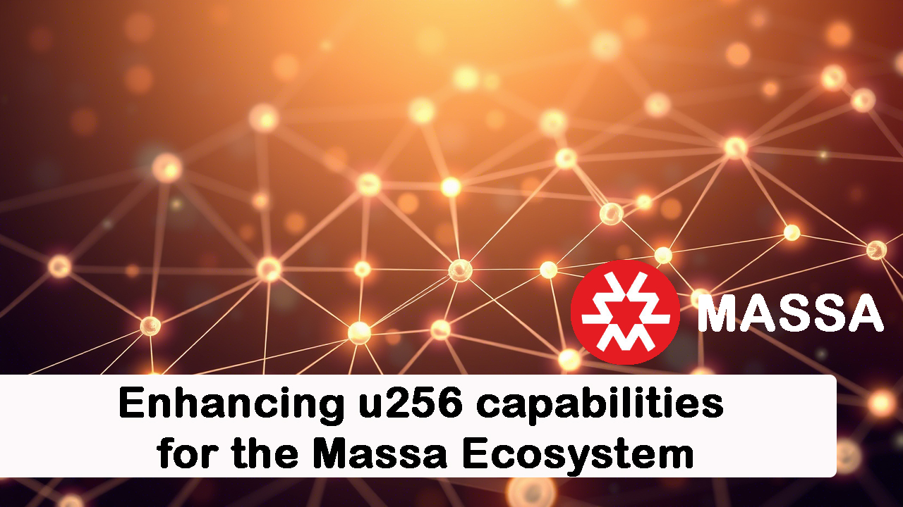

# EagleFi: Enhancing u256 capabilities for the Massa Ecosystem

The development of EagleFi, an automated market maker (AMM) DEX on the Massa blockchain, highlighted a need for more robust tooling and examples around `u256` arithmetic, which is fundamental for DeFi applications. While Massa provides the `u256` type via `as-bignum`, practical implementations of safe arithmetic and essential mathematical functions like square root were less prevalent in readily available examples within the ecosystem during our development.

EagleFi addressed this by implementing and refining several `u256` focused utilities. We believe sharing these solutions can significantly benefit other developers building complex financial applications on Massa. This document outlines key `u256` libraries and patterns derived from the [EagleFi codebase](https://github.com/NaDasai/eagle-finance), which other projects can adopt or learn from.

<!-- truncate -->

## Table of Contents

- [EagleFi: Enhancing u256 capabilities for the Massa Ecosystem](#eaglefi-enhancing-u256-capabilities-for-the-massa-ecosystem)
  - [Table of Contents](#table-of-contents)
  - [1. SafeMath Library for u256 Arithmetic](#1-safemath-library-for-u256-arithmetic)
  - [2. Integer Square Root (sqrt) for u256](#2-integer-square-root-sqrt-for-u256)
  - [3. Reference Implementation: Practical SafeMath Usage](#3-reference-implementation-practical-safemath-usage)
  - [4. Reference Implementation: u256 Support in Liquidity Management](#4-reference-implementation-u256-support-in-liquidity-management)
  - [5. Conclusion](#5-conclusion)

---

## 1. SafeMath Library for u256 Arithmetic

**Problem:** Financial calculations in DeFi often involve very large numbers (u256). Standard integer arithmetic lacks protection against overflows and underflows, which can lead to critical vulnerabilities and incorrect calculations.

**Contribution:** EagleFi provides `SafeMath256`, a library offering checked arithmetic operations (`add`, `sub`, `mul`, `div`, `mod`) specifically for `u256` values. Any operation that would result in an overflow or underflow will cause the transaction to revert, ensuring calculation integrity.

**Benefits for the Ecosystem:** Offers a fundamental building block for secure DeFi development on Massa, preventing common arithmetic vulnerabilities when dealing with large token amounts or complex financial logic involving `u256`.

**Implementation Snippets:**

```typescript
export class SafeMath256 {
  /**
   * Returns the addition of two unsigned integers,
   * reverting on overflow.
   */
  static add(a: u256, b: u256): u256 {
    const c = u256.add(a, b);
    assert(c >= a, 'SafeMath: addition overflow');
    return c;
  }

  /**
   * Returns the integer division of two unsigned integers.
   * Reverts with custom message on division by zero.
   */
  static sub(a: u256, b: u256): u256 {
    assert(b <= a, 'SafeMath256: substraction overflow');
    const c = u256.sub(a, b);
    return c;
  }

  /**
   * Returns the multiplication of two unsigned integers,
   * reverting on overflow.
   */
  static mul(a: u256, b: u256): u256 {
    if (a.isZero()) {
      return u256.Zero;
    }

    const c = u256.mul(a, b);
    assert(u256.eq(u256.div(c, a), b), 'SafeMath: multiplication overflow');
    return c;
  }

  /**
   * Returns the integer division of two unsigned integers.
   * Reverts on division by zero.
   */
  static div(a: u256, b: u256): u256 {
    assert(u256.gt(b, u256.Zero), 'SafeMath: division by zero');
    const c = u256.div(a, b);
    return c;
  }

  /**
   * Returns the remainder of dividing two unsigned integers.
   * Reverts with custom message when dividing by zero.
   */
  static mod(a: u256, b: u256): u256 {
    assert(!b.isZero(), 'SafeMath: modulo by zero');
    return u256.rem(a, b);
  }
}
```
*   *Find the full library in:* `[https://github.com/NaDasai/eagle-finance/blob/55592c9b82fd08d47c5741aca76e97a5673b3061/smart-contracts/assembly/lib/safeMath.ts#L107]`

## 2. Integer Square Root (sqrt) for u256

**Problem:** Calculating the integer square root is a common requirement in AMM formulas (e.g., for initial liquidity minting based on geometric mean in Uniswap V2 style pools), but it's not a standard operation provided for `u256` types, and implementations were not readily available as standard libraries in the Massa ecosystem.

**Contribution:** EagleFi includes an efficient implementation of the integer square root function for `u256`, utilizing the Babylonian method (or Newton's method).

**Benefits for the Ecosystem:** Provides a readily available mathematical utility essential for developers implementing various DeFi protocols, particularly AMMs, on Massa, filling a gap in standard `u256` functionality.

**Implementation Snippet:**

```typescript
/**
 * Returns the square root of an unsigned integer.
 */
static sqrt(a: u256): u256 {
  assert(!a.isZero(), 'SafeMath: sqrt of zero');
  let x = a;
  let y = u256.add(u256.div(x, u256.from(2)), u256.One);
  while (u256.lt(y, x)) {
    x = y;
    y = u256.div(u256.add(u256.div(a, x), x), u256.from(2));
  }
  return x;
}
```
*   *Find the implementation within:* `[https://github.com/NaDasai/eagle-finance/blob/55592c9b82fd08d47c5741aca76e97a5673b3061/smart-contracts/assembly/lib/safeMath.ts#L184]`

## 3. Reference Implementation: Practical SafeMath Usage

**Context:** While providing libraries like `SafeMath256` is useful, demonstrating their practical application within core DeFi logic involving `u256` offers valuable insights for developers navigating these large number types.

**Contribution:** The EagleFi codebase serves as a reference, showcasing how `SafeMath256` (including `sqrt`) is integrated into essential AMM calculations like fee determination and liquidity minting, all operating on `u256` values.

**Benefits for the Ecosystem:** Offers concrete examples for developers implementing similar financial logic requiring `u256`, reducing potential errors and promoting best practices for safe arithmetic in Massa smart contracts.

**Example Snippets:**

```typescript
// Fee Calculation Example
/**
 * Calculates the fee from a given input amount and fee rate.
 */
export function getFeeFromAmount(inputAmount: u256, feeRate: u64): u256 {
  // convert fee rate to u256
  const feeRate256 = u256.fromU64(feeRate);

  // Calculate the fee as: (inputAmount * feeRate256) / SCALING_FACTOR
  const product = SafeMath256.mul(inputAmount, feeRate256); // Using SafeMath
  const fee = SafeMath256.div(product, SCALING_FACTOR); // Using SafeMath

  return fee;
}

// Amount Without Fee Example
/**
 * Calculates the amount without fee from a total amount and a fee rate.
 */
export function getAmountWithoutFee(totalAmount: u256, feeRate: u64): u256 {
  const feeRateU256 = u256.fromU64(feeRate);
  const denominator = SafeMath256.add(SCALING_FACTOR, feeRateU256); // Using SafeMath
  const amountWithoutFee = SafeMath256.div( // Using SafeMath
    SafeMath256.mul(totalAmount, SCALING_FACTOR), // Using SafeMath
    denominator,
  );

  return amountWithoutFee;
}

// Initial Liquidity Calculation Example
// (Inside a function like _addLiquidity)
if (reserveA == u256.Zero && reserveB == u256.Zero) {
  // Initial liquidity: liquidity = sqrt(amountA * amountB)
  const product = SafeMath256.mul(normAmountA, normAmountB); // Using SafeMath
  // liquidity = sqrt(product) - MINIMUM_LIQUIDITY
  liquidity = SafeMath256.sub(SafeMath256.sqrt(product), MINIMUM_LIQUIDITY); // Using SafeMath sqrt & sub
  isInitialLiquidity = true;
} else {
  // Proportional liquidity calculation using SafeMath div and mul...
  const amountBOptimal = SafeMath256.div( // Using SafeMath
    SafeMath256.mul(normAmountA, normReserveB), // Using SafeMath
    normReserveA,
  );
  // ... more calculations using SafeMath ...
  const liquidityA = SafeMath256.div( // Using SafeMath
    SafeMath256.mul(normAmountA, totalSupply), // Using SafeMath
    normReserveA,
  );
  const liquidityB = SafeMath256.div( // Using SafeMath
    SafeMath256.mul(normAmountBFinal, totalSupply), // Using SafeMath
    normReserveB,
  );
  liquidity = u256.min(liquidityA, liquidityB);
}
```
*   *Find more examples in:* `[assembly/libraries/basicPoolMath.ts, assembly/contracts/pools/BasicPool.ts]`

## 4. Reference Implementation: u256 Support in Liquidity Management

**Context:** Many DeFi protocols need to handle potentially huge token balances and liquidity figures, especially with high-decimal tokens. Using `u64` can lead to overflows. Ensuring core components work natively with `u256` is crucial.

**Contribution:** EagleFi's core components, such as the logic managing LP token minting/burning and balance tracking (`LiquidityManager`), are designed to operate natively with `u256`. This ensures the protocol can handle large values accurately and avoids potential overflow issues present with smaller integer types.

**Benefits for the Ecosystem:** Provides a design pattern and reference for building Massa contracts that are robust and capable of handling the large numerical scales common in DeFi, ensuring compatibility and accuracy when using `u256`.

**Implementation Snippets:**

```typescript
// Generic LiquidityManager structure (conceptual)
export class LiquidityManager<T> { // T can be u256
  private balancePrefix: u8;
  private allowancePrefix: u8;

  constructor(storagePrefixManager: StoragePrefixManager) {
    this.balancePrefix = storagePrefixManager.newPrefix();
    this.allowancePrefix = storagePrefixManager.newPrefix();
  }

  // Methods...
}

// Internal update logic handling u256 specifically
private _updateAmount(key: StaticArray<u8>, amount: T, increase: bool): void {
  var newAmount = this._getOrNull(key);
  if (increase) {
    if (idof<T>() == idof<u256>()) { // Check if T is u256
      newAmount = u256.add(newAmount, amount) as T; // Use u256.add
    } else {
      // @ts-ignore arithmetic operations on generic types
      newAmount += amount;
    }
  } else {
    if (idof<T>() == idof<u256>()) { // Check if T is u256
      newAmount = u256.sub(newAmount, amount) as T; // Use u256.sub
    } else {
      // @ts-ignore arithmetic operations on generic types
      newAmount -= amount;
    }
  }
  Storage.set(key, this.serialize(newAmount));
}

// Usage example in Pool (adding liquidity)
// Create new liquidity manager representing the pool LP token
const storagePrefixManager = new StoragePrefixManager();
// Instantiate specifically for u256 LP tokens
const liquidityManager = new LiquidityManager<u256>(storagePrefixManager);

// Mint LP tokens (u256 amount) to user
export function addLiquidity(binaryArgs: StaticArray<u8>): addLiquidityData {
  // ... calculation logic resulting in 'liquidity' as u256 ...

  // Permanently lock the first MINIMUM_LIQUIDITY tokens
  if (isInitialLiquidity) {
    // Mint MINIMUM_LIQUIDITY tokens to empty address
    liquidityManager.mint(new Address(''), MINIMUM_LIQUIDITY); // MINIMUM_LIQUIDITY is u256
  }

  // Mint LP tokens to user
  liquidityManager.mint(callerAddress, liquidity); // liquidity is u256

  // ... update reserves ...

  // Return data including u256 amounts
  return new addLiquidityData(
    contractAddress.toString(),
    callerAddress.toString(),
    finalAmountA, // u256
    finalAmountB, // u256
    liquidity,    // u256
    newResA,      // u256
    newResB,      // u256
  );
}
```
*   *Find the implementation details in:* `[assembly/contracts/libraries/LiquidityManager.ts, assembly/contracts/pools/BasicPool.ts]`

## 5. Conclusion

EagleFi's development journey necessitated significant work in establishing robust and safe handling of `u256` values, an area with limited examples in the early Massa ecosystem. By contributing the `SafeMath256` library, an efficient `sqrt` implementation for `u256`, and providing reference implementations for their practical usage within core DeFi logic like liquidity management, we hope to lower the barrier for other developers building sophisticated financial applications on Massa. We encourage the community to utilize, adapt, and build upon these `u256` focused contributions.


